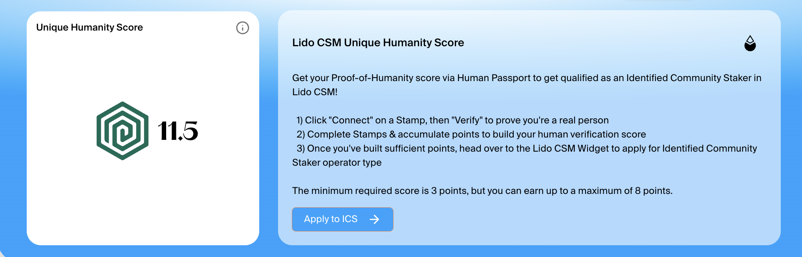

# MetaMask OG Campaign

### Overview

Human Passport has partnered with [theMiracle](https://themiracle.io) to reward selected MetaMask users as part of HUMN onchain SUMR (Season 1).

This campaign provides bonus HUMN points to long-time MetaMask users identified by theMiracle.

***

### Eligibility

* This campaign is exclusive to MetaMask users who have been selected by TheMiracle.
* Only these selected wallets will see the campaign listed as an active airdrop in MetaMask Portfolio.
* Existing Human Passport users may also be eligible for a 2x multiplier on their HUMN points if they qualified before the SUMR launch.

***

### Rewards

* The first 5,000 selected MetaMask users who log into the Human Passport app through MetaMask and reach a Humanity Score of 20+ will receive 1,000 bonus HUMN points.
* If you already verified with Passport before the SUMR launch (July 14), you may automatically receive a 2x multiplier on your points.

***

### How to Participate

#### In MetaMask

1. Open [MetaMask Portfolio](https://portfolio.metamask.io/)
2. Connect your MetaMask wallet and go to the Dashboard
3. If you are eligible, check for active airdrops
4. Click the button and proceed to claim

<figure><figcaption></figcaption></figure>

#### In Human Passport

5. Log in and collect Stamps until your Humanity Score is 20 or higher
6. Hover over the HUMN icon in the top-right corner to view your total points, including the 1,000 OG bonus if eligible

<figure><figcaption></figcaption></figure>

***

### Notes

* Participation is limited to the first 5,000 eligible MetaMask users.
* Points are added once the Humanity Score requirement is met.
* This campaign is part of [HUMN onchain SUMR](https://support.passport.xyz/passport-knowledge-base/humn-points-program/welcome-to-humn-onchain-sumr-season-1), a seasonal program rewarding verified human activity across the human.tech ecosystem.

***

### FAQ

**What if I don’t see the campaign in MetaMask Portfolio?**

* Only theMiracle-selected wallets are eligible. If you don’t see an active airdrop, your wallet did not qualify.&#x20;

**What if I already have a Humanity Score of 20+?**

* If you've been selected as MetaMask OG, you’ll still receive the 1,000 bonus points once you log in through the MetaMask Portfolio airdrops.&#x20;

**How do I know if my bonus points were added?**

* Log into the Passport app and hover over the HUMN icon in the top-right corner. Your total HUMN points, including the bonus, will be displayed.

**What is the 2x multiplier?**

* If you verified with Passport before SUMR launched, you may receive a 2x multiplier on your HUMN points automatically. This applies separately from the MetaMask OG bonus. Learn more: [returning-user-2x-multiplier.md](returning-user-2x-multiplier.md "mention")

**Can I participate with multiple wallets?**

* No. The campaign is restricted to wallets pre-selected by theMiracle. Only those wallets can claim the bonus.
