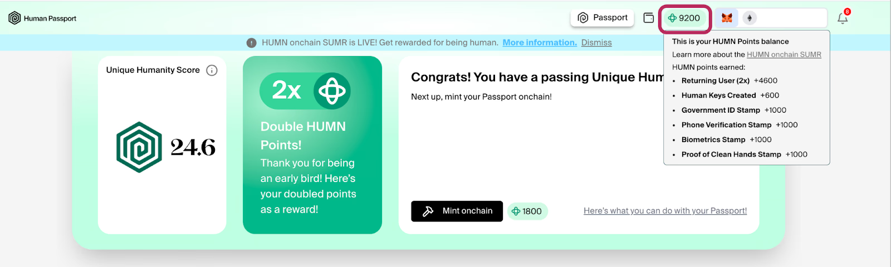

# HUMN Season 1: wrap-up

[**Season 1**](https://support.passport.xyz/passport-knowledge-base/humn-points-program/welcome-to-humn-onchain-sumr-season-1) was a prelude, focused entirely on Passport; a long summer that put us into real onchain flows. [HUMN Points](https://support.passport.xyz/passport-knowledge-base/humn-points-program/score-20-start-collecting-humn-points) helped capture the attention of many previously unfamiliar with the product, giving new users a reason to create a Passport and understand what it’s for. Those who already used Passport before got extra perks, including a [2x points multiplier](https://support.passport.xyz/passport-knowledge-base/humn-points-program/humn-points-boosters/returning-user-2x-multiplier).

<figure><figcaption></figcaption></figure>

## Season 1 in stats

By the end of the season, participation exceeded our expectations:

* **68.8K wallets** became eligible participants
* **30.3K humans** connected to Passport for the first time - welcome!
* **32.8K users** earned their first meaningful credential
* **39.4K OGs** returned as active participants
* **228M points** were earned in total
* **3.38K points** was the average per wallet
* **38.6K Passport scores** were minted onchain

<figure><figcaption></figcaption></figure>

## What happened in Season 1

* Users collected HUMN Points in the [Passport App](https://app.passport.xyz/) while proving their unique humanity. The [Unique Humanity Score](https://support.passport.xyz/passport-knowledge-base/common-questions/what-is-unique-humanity) of 20 was an initial eligibility criterion.
* Returning users received bonuses like [2x Multiplier](https://support.passport.xyz/passport-knowledge-base/humn-points-program/humn-points-boosters/returning-user-2x-multiplier), [3x Campaign Participant](https://support.passport.xyz/passport-knowledge-base/humn-points-program/humn-points-boosters/active-campaigns-participant), [MetaMask OG](https://support.passport.xyz/passport-knowledge-base/humn-points-program/humn-points-boosters/metamask-og-campaign), [Passport OG](https://support.passport.xyz/passport-knowledge-base/humn-points-program/humn-points-boosters/seasoned-passport-og-bonus), and the [Chosen One](https://support.passport.xyz/passport-knowledge-base/humn-points-program/humn-points-boosters/seasoned-passport-og-bonus#rewards), while all users were able to build their score with [Human Key Creator](https://support.passport.xyz/passport-knowledge-base/humn-points-program/humn-points-boosters/human-keys-creator) bonuses.
* [HUMN Points](https://support.passport.xyz/passport-knowledge-base/humn-points-program/quick-guide-to-scoring-humn-points) exemplify users’ humanity and are proof of their onchain presence. The Passports created during the campaign can further be used in the Passport-protected campaigns.
* Over 38K [Onchain Passports](https://support.passport.xyz/passport-knowledge-base/using-passport/onchain-passport) were created during the campaign, representing nearly 20,000 humans who chose to mint onchain across the chains. Partners can access those scores [directly onchain](https://docs.passport.xyz/building-with-passport/stamps/smart-contracts/introduction) with Onchain Passport functionality, without API integration.

In short, Season 1 was about verifying unique human participation in a self-sovereign and private way. Nearly 70K humans earned HUMN Points towards ecosystem incentives. With that foundation in place, we now invite users to express their unique humanity.

## **Learn more about Season 2**


