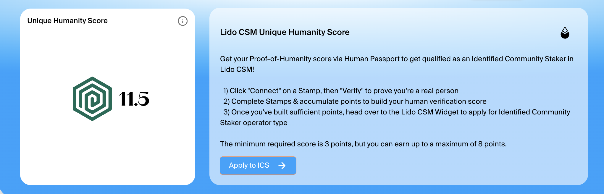

# Lido ICS – Proof of Humanity


**Stamp weights and point values for this campaign differ from the defaults in the Passport app (**[**app.passport.xyz**](https://app.passport.xyz)**)**


## Overview

[The Lido protocol](https://lido.fi) is the leading liquid staking protocol, allowing you to stake ETH while keeping tokens liquid through stETH.&#x20;

**This campaign connects Lido’s Community Staking Module with Human Passport,** making sure participants applying for the new Identified Community Staker (ICS) role are verified, unique humans. It’s part of Lido’s broader move toward a pluralistic proof of personhood system, where no single verification method dominates.

**For users, that means:**

* If you already have a Passport, you can use it as a proof-of-humanity source when applying to be an ICS, which allows you to get exclusive benefits when using Lido's CSM to run validators.&#x20;
* If you’re new, you can build your Humanity Score in Passport and step into one of DeFi’s most established ecosystems.

***

## How Lido uses Human Passport

Lido’s Community Staking Module uses a mix of verification methods, with Human Passport covering part of the proof of humanity (PoH) requirement.

### Lido’s Passport setup:

* Custom dashboard with Lido-specific scoring.
* Minimum score of 3 Passport points to qualify.
* Scores are mapped 1:1 into Lido’s own system (max 8 points).
* The score is capped at 8 points.

<figure><figcaption></figcaption></figure>

### Custom scoring breakdown:

| Stamp                | Credential                                     | Weight | Lido Weight |
| -------------------- | ---------------------------------------------- | ------ | ----------- |
| Binance              | Verify your Binance Account Bound Token (BABT) | 10.021 | 5           |
| Biometrics           | Unique Biometric Identity                      | 5.000  | 5           |
| BrightID             | Peer-Verified Identity                         | 0.202  | 0.5         |
| Coinbase             | Coinbase KYC Verified                          | 4.042  | 3           |
| Discord              | Verify Discord Account Ownership               | 0.516  | 0.5         |
| ENS                  | ENS Domain Owner                               | 0.208  | 0.2         |
| ETH Activity         | total                                          | 22.541 | 3           |
| ETH Activity         | ETH Enthusiast                                 | 16.021 | 2.132       |
| ETH Activity         | ETH Advocate                                   | 2.399  | 0.319       |
| ETH Activity         | ETH Maxi                                       | 2.926  | 0.390       |
| ETH Activity         | Active on over 50 distinct days                | 0.207  | 0.028       |
| ETH Activity         | Spend more than 0.25 ETH on gas                | 0.778  | 0.104       |
| ETH Activity         | Execute over 100 transactions                  | 0.210  | 0.028       |
| Gitcoin              | total                                          | 6.237  | 1           |
| Gitcoin              | Bronze Contributor                             | 0.223  | 0.04        |
| Gitcoin              | Silver Contributor                             | 1.017  | 0.16        |
| Gitcoin              | Gold Contributor                               | 4.997  | 0.80        |
| GitHub               | total                                          | 6.026  | 2           |
| GitHub               | Regular Contributor                            | 1.879  | 0.62        |
| GitHub               | Active Developer                               | 1.888  | 0.63        |
| GitHub               | Dedicated Coder                                | 2.259  | 0.75        |
| Google               | Verify Google Account Ownership                | 0.525  | 0.5         |
| Government ID        | Government ID Holder                           | 16.026 | 5           |
| Guild                | total                                          | 0.708  | 0.5         |
| Guild                | Member with 1 or more roles in Passport Guild  | 0.240  | 0.2         |
| Guild                | Owner or Administrator of one or more guilds   | 0.468  | 0.3         |
| Idena                | total                                          | 9.736  | 0.7         |
| Idena                | Newbie                                         | 5.892  | 0.3         |
| Idena                | Verified                                       | 1.924  | 0.2         |
| Idena                | Human                                          | 1.921  | 0.2         |
| Identity Staking     | total                                          | 12.506 | 3           |
| Identity Staking     | Bronze Staker                                  | 0.897  | 0.215       |
| Identity Staking     | Silver Staker                                  | 2.066  | 0.496       |
| Identity Staking     | Gold Staker                                    | 2.700  | 0.648       |
| Identity Staking     | Community Participant                          | 0.673  | 0.161       |
| Identity Staking     | Active Community Member                        | 2.161  | 0.519       |
| Identity Staking     | Trusted Community Leader                       | 4.009  | 0.962       |
| Lens                 | Lens Handle Owner                              | 0.230  | 0.2         |
| Linkedin             | Verify LinkedIn Account Ownership              | 1.531  | 0.5         |
| NFT                  | total                                          | 22.053 | 3           |
| NFT                  | Digital Collector                              | 16.246 | 2.211       |
| NFT                  | Art Aficionado                                 | 2.362  | 0.321       |
| NFT                  | NFT Visionary                                  | 2.413  | 0.328       |
| NFT                  | Holds at least 1 NFT (ERC-721)                 | 1.032  | 0.141       |
| Phone Verification   | Verified Phone Number                          | 1.521  | 0.5         |
| Proof of Clean Hands | Sanctions-Free Identity Verified               | 1.000  | -           |
| Safe                 | Safe Wallet Owner                              | 0.222  | 0.25        |
| Snapshot             | Proposal Creator                               | 0.239  | 0.2         |

<figure><figcaption></figcaption></figure>

### **Capped score mapping example:**

| Human Passport points | Lido dashboard points      |
| --------------------- | -------------------------- |
| 2 Passport points     | 0 in Lido system           |
| 3 Passport points     | 3 in Lido system           |
| 5 Passport points     | 5 in Lido system           |
| 8 Passport points     | 8 in Lido system           |
| 9+ Passport points    | capped at 8 in Lido system |

***

## How to join

### Campaign dates:

* **Start:** Monday, August 27, 2025
* **Finish:** TBA

### **You’ll need:**

* A crypto wallet
* A Humanity Score of at least 3 (by Lido's custom score)

### **Step-by-step:**

1. Go to Lido’s custom Passport dashboard: [app.passport.xyz/#/lido\_csm/dashboard](http://app.passport.xyz/#/lido_csm/dashboard)&#x20;
2. Connect your wallet and sign in.
3. Collect Stamps to reach a score of 3+ (but not more than 8).
4. Head to the Lido Community Staking Module: [https://csm.lido.fi/type/ics-system](https://csm.lido.fi/type/ics-system)&#x20;
5. Apply to be an ICS and start running validators using CSM.

### Why Verify?

With ICS, all independent stakers can join on better terms, improving Ethereum’s decentralisation.&#x20;

Once verified with Human Passport, their score also counts for different campaigns across web3, including ongoing [HUMN onchain SUMR](../humn-points-program/welcome-to-humn-onchain-sumr-season-1.md).&#x20;

<figure><figcaption></figcaption></figure>

***

## About Lido

The Lido protocol lets anyone stake ETH without locking tokens or maintaining infrastructure, while still participating in on-chain activities. Its mission is to make staking simple and decentralized, opening up participation to as many people as possible.

At the same time, Lido allows operators to directly support Ethereum’s security by running validators through its different modules.

The Community Staking Module (CSM) is one of these modules, and the first permissionless one. It enables anyone to run validators using the Lido protocol with low capital requirements and enhanced rewards, with the goal of empowering more independent stakers to participate in Ethereum validation.

More on Lido:[ lido.fi](https://lido.fi)

***

## FAQ

#### **❓ I verified Stamps in Human Passport Stamps before. Will they count in the Lido dashboard?**

Yes, previously verified Stamps will count towards your Lido score. However, given that the Stamp weights and point values are different for Lido, you will likely see a different score than in our app.

#### **❓ Why is my score different between the Passport app and the Lido dashboard?**

Lido is using a Custom Passport setup, and they decided to assign different weights and point values to Stamps. This is to better reflect their specific campaign needs.

#### **❓ How many points can I score through Passport for the CSM?**

On the Lido dashboard, you can score between 3 and 8 points. These are mapped directly into Lido’s broader verification framework for the campaign. It’s not possible to score more than 8 points, even if additional Stamps are verified.

#### **❓ Can I change my wallet after verifying?**

No. Verification is tied to the wallet you connected when collecting Stamps. Make sure to use the same wallet for both HumanPassport and the Community Staking Module.

#### **❓ Do I have to verify with ICS to run a node with Lido?**

No, ICS participation is optional. ICS comes with certain benefits, like a lower bond for the first validator, but CSM remains fully permissionless and can be accessed without verification.

#### **❓ Do Stamps verified for the Lido campaign count in the main Passport app too?**

Yes! Stamps verified for the Lido campaign will count in the main app – they will only display a different point value there. You can continue to participate in different Passport-secured campaigns using the same Stamps.[ HUMN onchain SUMR](https://support.passport.xyz/passport-knowledge-base/humn-points-program/welcome-to-humn-onchain-sumr-season-1) is one of the campaigns currently live.

#### **❓ What does it mean that the Lido score is capped at 8?**

The score is capped at 8 means that verifying additional Stamps will not increase the score above 8 points. It's not possible to score more than the capped amount.&#x20;

***

### Need help?

* Passport setup issues: [Passport Support](https://support.passport.xyz)
* Lido Community: [Join on Discord](https://discord.com/invite/lido)
